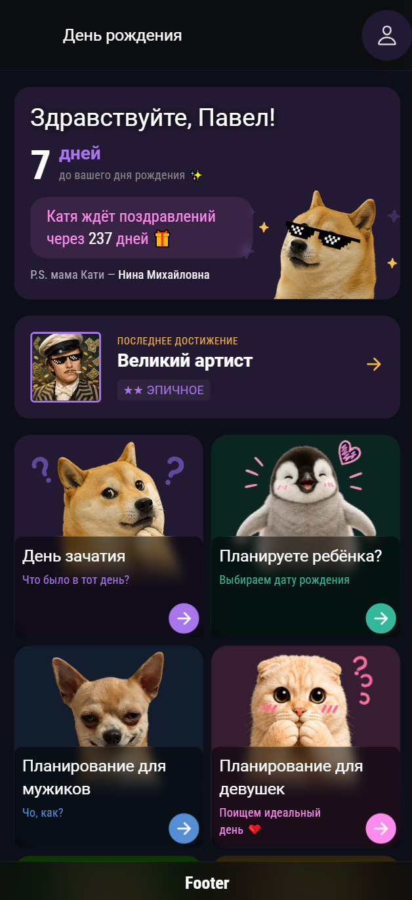
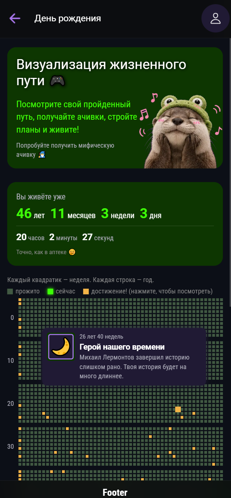
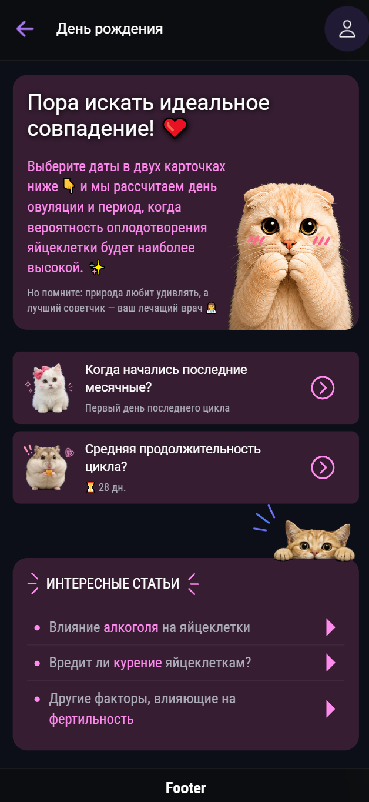

<div align="center">
  

  # День рождения 🎂

  Мобильное приложение о датах вашей жизни: от планирования зачатия до визуализации прожитых недель и достижений.

</div>

---

## 📱 Скриншоты

<table>
  <tr>
    <td width="50%" align="center">
      <br />
      <b>Главная</b><br />
      Счётчик до дня рождения, важные даты, последнее достижение
    </td>
    <td width="50%" align="center">
      <br />
      <b>Жизненный прогресс</b><br />
      Сетка недель жизни и ачивки прямо на ней
    </td>
  </tr>
  <tr>
    <td width="50%" align="center">
      <br />
      <b>Планирование для девушек</b><br />
      День овуляции и фертильное окно
    </td>
    <td width="50%" align="center">
      <br />
      <b>Планирование для мужиков</b><br />
      Оптимальные дни с учётом алкоголя и воздержания
    </td>
  </tr>
  <tr>
    <td width="50%" align="center">
      <br />
      <b>Планируете ребёнка?</b><br />
      Дата зачатия под желаемый день рождения
    </td>
    <td width="50%"></td>
  </tr>
</table>

---

## ✨ Возможности

### 🎂 Важные даты
- Счётчик дней до вашего дня рождения
- Напоминание о дне рождения близкого человека — с отдельным предупреждением за несколько дней
- Шпаргалка «кто это»: тёща, начальник и другие, чьё имя лучше не забывать

### 🎮 Жизненный прогресс
- Каждая неделя жизни — квадратик, каждая строка — год, всё до расчётного предела
- Живой счётчик прожитого времени: годы, месяцы, недели, дни, часы, минуты, секунды
- Достижения прямо на сетке: возрастные вехи и недели жизни знаменитостей — с подсказками по тапу
- Можно поделиться своим прогрессом картинкой

### 🏆 Достижения
- Категории ачивок в JSON: возраст, знаменитости, а также заготовки под привычки (диета, борода), игры и технологии
- Пять уровней редкости: обычное, редкое, эпичное, легендарное, мифическое
- Виджет последнего полученного достижения — доступен с любой страницы

### 👶 Планирование зачатия и рождения
- **День зачатия** — по дате рождения покажет примерную дату зачатия и что происходило в тот день
- **Планируете ребёнка?** — выберите желаемый день рождения и получите расчётную дату зачатия
- Праздники, именины, знаки зодиака и памятные даты с учётом диапазона сроков беременности

### ♀️ Планирование для девушек
- Расчёт дня овуляции по дате последних месячных и длине цикла
- Фертильное окно с градацией вероятности зачатия
- Статьи о влиянии алкоголя, курения и других факторов на фертильность

### ♂️ Планирование для мужиков
- Оптимальные дни для зачатия с учётом воздержания от алкоголя и частоты эякуляций
- Алкоголь можно исключить из расчёта одним тапом
- Статьи о том, что влияет на качество спермы

---

## 🛠 Стек технологий

| Категория     | Технология                               |
|---------------|------------------------------------------|
| Фреймворк     | Vue 3 + Composition API (`script setup`) |
| Язык          | TypeScript 5.9 (strict)                  |
| UI / Мобайл   | Ionic 8 + Capacitor 8                    |
| Сборка        | Vite 8                                   |
| Стили         | SCSS + CSS Modules                       |
| Роутинг       | Vue Router 4                             |
| Состояние     | Реактивный стор на `reactive` из Vue     |
| Хранилище     | Capacitor Preferences                    |
| Шаринг        | Capacitor Share + Filesystem, html-to-image |
| Тесты         | Vitest (unit) + Cypress (e2e)            |

---

## 🚀 Запуск

### Веб (браузер)

```bash
npm install
npm run dev
```

### Android

```bash
npm run build:android
```

> Требуется установленный Android Studio и настроенный Capacitor.

---

## 🧪 Тесты и проверки

```bash
# Unit-тесты
npm run test:unit

# E2E-тесты
npm run test:e2e

# Линтер
npm run lint

# Сборка с проверкой типов
npm run build
```

---

## 📁 Структура проекта

```
src/
├── api/              # Работа с данными: праздники, именины, зодиак, ачивки
├── assets/           # Шрифты, глобальные стили, изображения
├── components/
│   ├── Achievement/  # Карточки, тултип и изображение достижения
│   ├── AppHeader/
│   ├── AppFooter/
│   ├── Ui/           # Базовые элементы (Input, DayCard)
│   └── Widgets/      # Блоки страниц: PageTitle, ArtButton, LifeTime, TipInfo...
├── composables/      # Утилиты: даты, склонения, картинки ачивок, шаринг
├── jsons/            # Датасеты: ачивки, праздники, именины, зодиак, знаменитости
├── router/           # Маршруты приложения
├── store/            # Глобальный стор и реактивная текущая дата
├── views/            # Страницы
│   ├── HomePage.vue
│   ├── AchievementsPage/
│   ├── ChildBirthday/
│   ├── DayConception/
│   ├── FemaleCalendar/
│   ├── LifeProgress/
│   ├── MaleCalendar/
│   └── UserProfile/
├── configApp.ts      # Все настраиваемые параметры приложения
└── main.ts           # Точка входа
```

---

## ⚙️ Данные и настройки

- **`configApp.ts`** — единая точка настроек: сроки беременности, периоды воздержания, параметры овуляции, продолжительность жизни в неделях, цвета разделов и редкостей достижений.
- **`jsons/achievements_*.json`** — достижения по категориям. Weeks-based (`age`, `famous`) привязаны к неделе жизни, остальные — к дням привычки или дате.
- **`jsons/`** — офлайн-датасеты праздников, именин, знаков зодиака и знаменитостей: приложение работает без интернета.

---

## 📜 Лицензия

Private — все права защищены.
