<div align="center">
  

  # День рождения 🎂

Мобильное приложение о датах жизни.<br />
В приложении можно рассчитать примерную дату зачатия, если вы хотите завести ребёнка к определённому дню или узнать примерный день, когда было зачатие, если вы знаете дату рождения.<br />
   Так же приложение считает дни до дня рождения, показывает прожитые недели сеткой, выдаёт достижения за возраст и кумиров, которых вы пережили и ведёт стрики полезных привычек. 

</div>

---

## 📱 Скриншоты

<table>
  <tr>
    <td width="50%" align="center">
      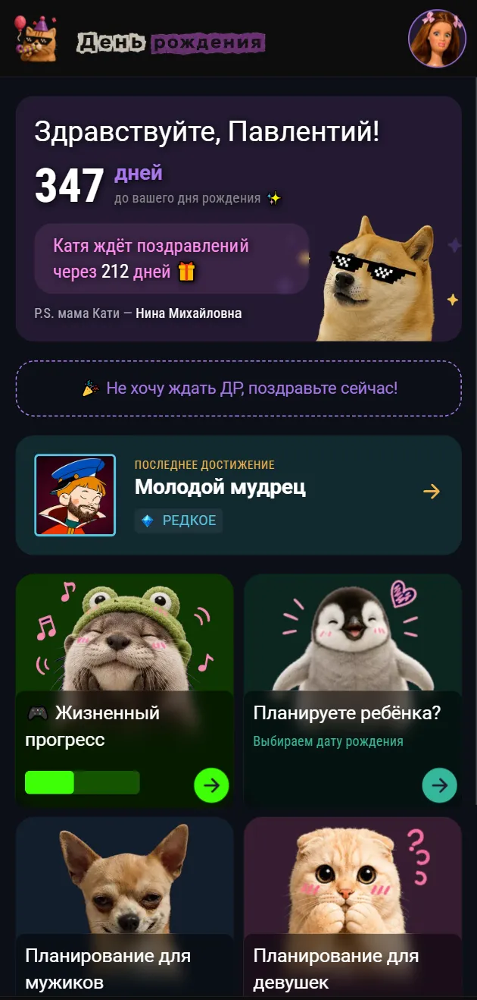<br />
      <b>Главная</b><br />
      Счётчик до дня рождения, важный человек, шпаргалка «кто это» и последнее достижение
    </td>
    <td width="50%" align="center">
      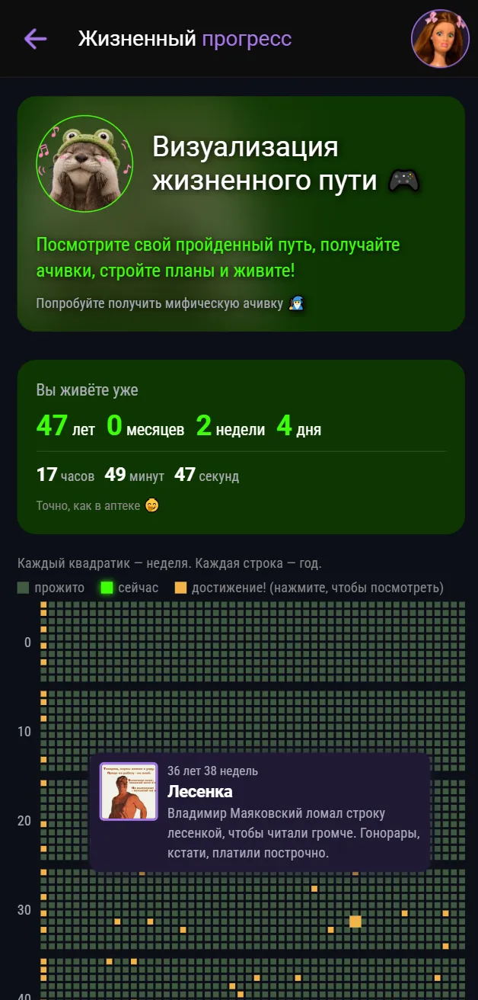<br />
      <b>Жизненный прогресс</b><br />
      Сетка недель жизни, живой счётчик и ачивки прямо на клетках
    </td>
  </tr>
  <tr>
    <td width="50%" align="center">
      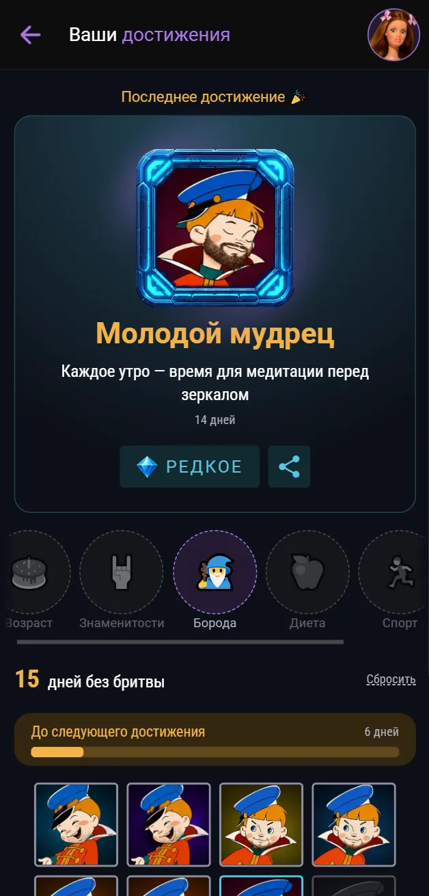<br />
      <b>Достижения</b><br />
      Табы групп, счётчик стрика и прогресс до следующего достижения
    </td>
    <td width="50%" align="center">
      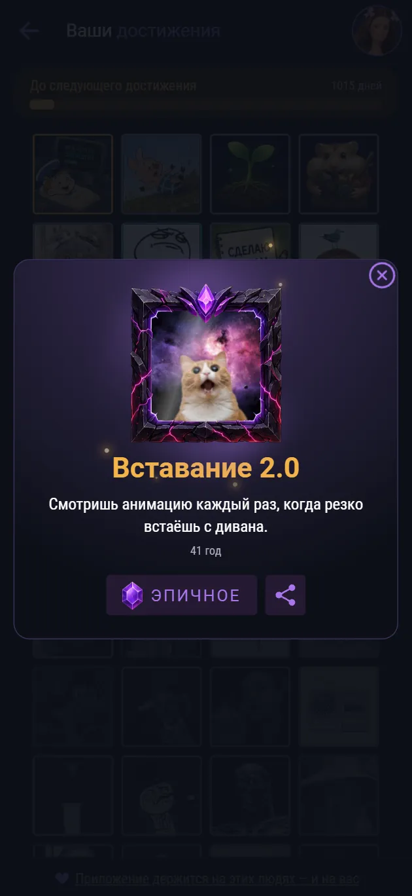<br />
      <b>Карточка достижения</b><br />
      Рамка по редкости и кнопка «поделиться»
    </td>
  </tr>
  <tr>
    <td width="50%" align="center">
      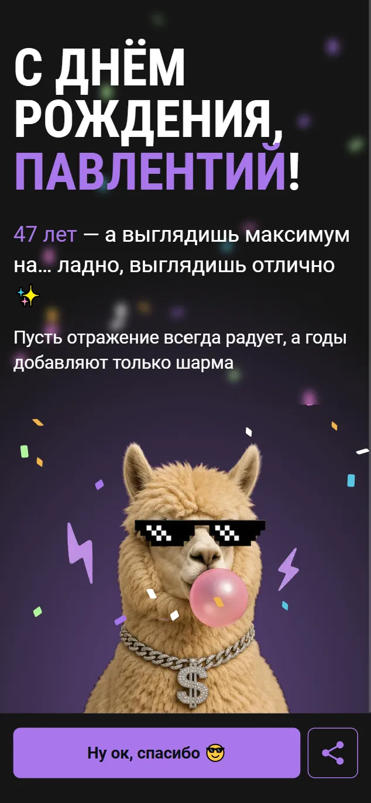<br />
      <b>Поздравление</b><br />
      Открывается само в день рождения — с конфетти и хлопушками или можно поздравить себя самому, нажав кнопку поздравления на главной странице
    </td>
    <td width="50%" align="center">
      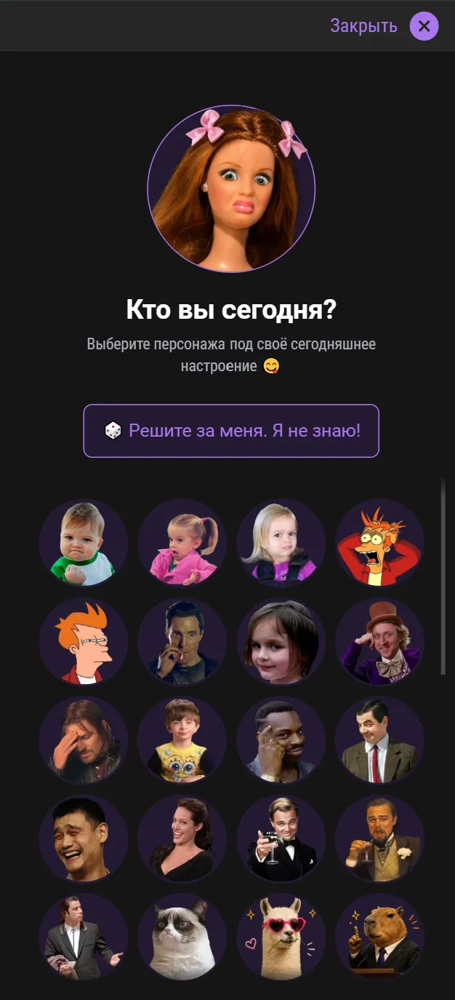<br />
      <b>Выбор аватарки</b><br />
      Персонаж под настроение или кубик «решите за меня»
    </td>
  </tr>
  <tr>
    <td width="50%" align="center">
      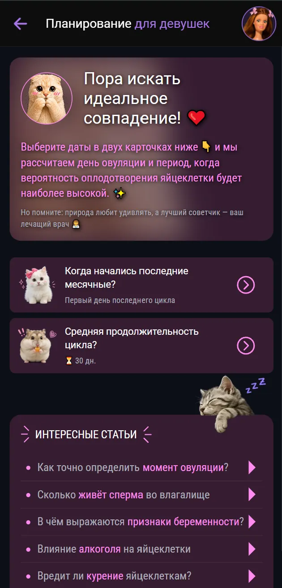<br />
      <b>Планирование для девушек</b><br />
      Дата последних месячных и длина цикла для расчёта окна фертильности
    </td>
    <td width="50%" align="center">
      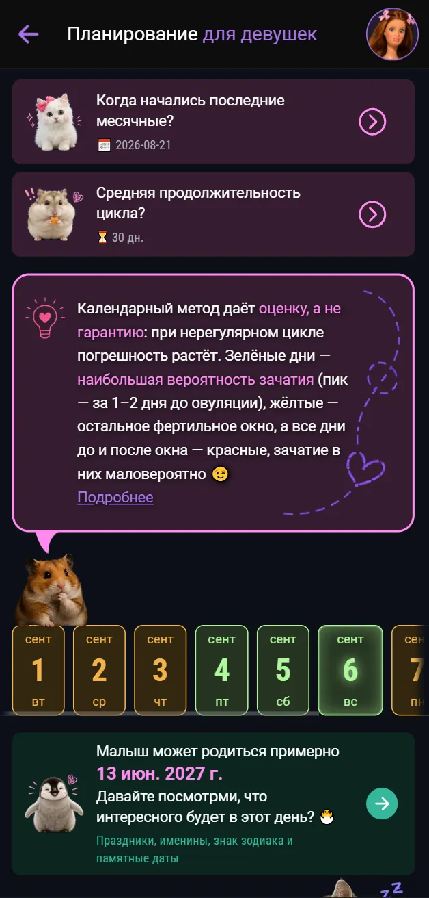<br />
      <b>Фертильное окно</b><br />
      Дни с градацией вероятности и предполагаемая дата рождения
    </td>
  </tr>
  <tr>
    <td width="50%" align="center">
      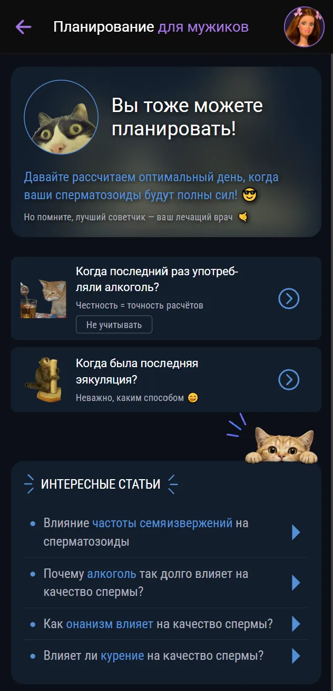<br />
      <b>Планирование для мужиков</b><br />
      Расчёт дней высокой активности сперматозоидов с учётом алкоголя и воздержания
    </td>
    <td width="50%" align="center">
      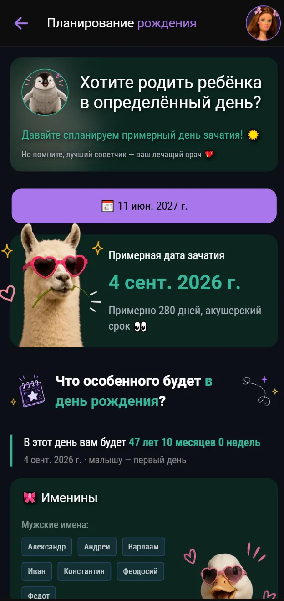<br />
      <b>Планирование рождения</b><br />
      Дата зачатия под желаемый день рождения ребёнка
    </td>
  </tr>
  <tr>
    <td width="50%" align="center">
      <br />
      <b>Дата зачатия</b><br />
      Обратный расчёт по дате рождения и что было в тот день
    </td>
    <td width="50%" align="center">
      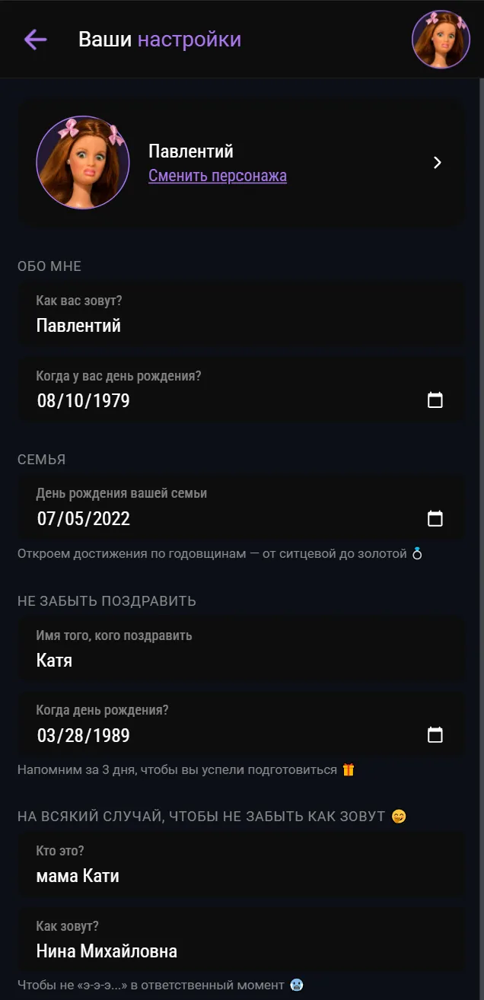<br />
      <b>Настройки</b><br />
      Даты, персонаж и шпаргалка «кто это»
    </td>
  </tr>
</table>

---

## ✨ Возможности

### 🎂 Важные даты
- Счётчик дней до вашего дня рождения
- Напоминание о дне рождения близкого человека — с отдельным предупреждением за несколько дней
- Шпаргалка «кто это»: тёща, начальник и другие, чьё имя лучше не забывать
- Поздравление с конфетти: в день рождения открывается само, один раз или если нажать на кнопку поздравления на главной странице и им можно поделиться
- Аватарка-персонаж под настроение — с кнопкой случайного выбора

### 🎮 Жизненный прогресс
- Каждая неделя жизни — квадратик, каждая строка — год, всё до расчётного предела
- Живой счётчик прожитого времени: годы, месяцы, недели, дни, часы, минуты, секунды
- Достижения прямо на сетке: возрастные вехи и недели жизни знаменитостей — с подсказками по тапу
- Можно поделиться своим прогрессом картинкой

### 🏆 Достижения
- Шесть групп в табах: возраст, знаменитости, борода, диета, спорт и свадьба
- Стрики привычек идут параллельно — у каждого свой запуск, сброс и ручной ввод даты начала, если привычка появилась раньше приложения
- Достижения за прожитые в браке года
- Прогресс-бар до следующего достижения и счётчик пройденных дней внутри группы
- Пять уровней редкости со своей рамкой и иконкой: обычное, редкое, эпичное, легендарное, мифическое
- Карточка достижения открывается модалкой, ей можно поделиться картинкой
- Виджет последнего полученного достижения — доступен с главной и со страницы ачивок
- В `jsons/` лежат заготовки под будущие группы: игры, технологии, особые события и дни рождения — они пока не подключены к расчёту

### 👶 Планирование зачатия и рождения
- **Дата зачатия** — по дате рождения покажет примерную дату зачатия и что происходило в тот день
- **Планирование рождения** — выберите желаемый день рождения и получите расчётную дату зачатия
- Праздники, именины, знаки зодиака и памятные даты с учётом диапазона сроков беременности

### ♀️ Планирование для девушек
- Расчёт дня овуляции по дате последних месячных и длине цикла
- Длина цикла запоминается — выбрать её нужно один раз
- Фертильное окно с градацией вероятности зачатия
- Статьи о влиянии алкоголя, курения и других факторов на фертильность

### ♂️ Планирование для мужиков
- Оптимальные дни для зачатия с учётом воздержания от алкоголя и частоты эякуляций
- Алкоголь можно исключить из расчёта одним тапом
- Статьи о том, что влияет на качество спермы

### 💜 Поддержка проекта
<table>
<tr>
    <td>
      <br />
      <b>Ваша помощь</b><br />
      Список тех, благодаря кому проект живёт
    </td>
    <td>
      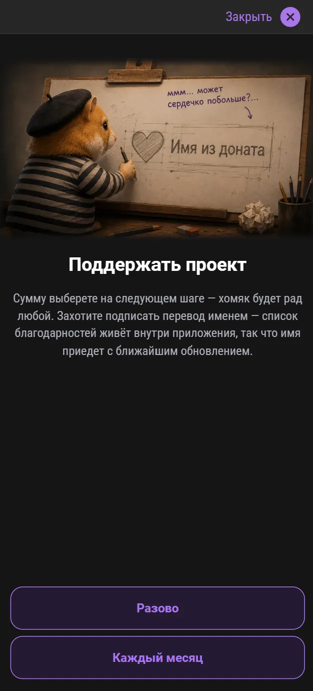<br />
      <b>Поддержать проект</b><br />
      Разовый перевод или ежемесячный, с именем в списке благодарностей
    </td>
  </tr>
</table>
<br /><br />
- Страница благодарностей со списком тех, кто помог проекту
- Перевод разовый или ежемесячный (подписка на Boosty), сумму выбирают на стороне платёжного сервиса
- Имя из доната попадает в список благодарностей с очередным обновлением

---

## 🛠 Стек технологий

| Категория     | Технология                               |
|---------------|------------------------------------------|
| Фреймворк     | Vue 3 + Composition API (`script setup`) |
| Язык          | TypeScript 5.9 (strict)                  |
| UI / Мобайл   | Ionic 8 + Capacitor 8                    |
| Сборка        | Vite 8                                   |
| Стили         | SCSS + CSS Modules                       |
| Роутинг       | Vue Router 4                             |
| Состояние     | Реактивный стор на `reactive` из Vue     |
| Хранилище     | Capacitor Preferences                    |
| Шаринг        | Capacitor Share + Filesystem, html-to-image |
| Внешние ссылки | Capacitor Browser                       |
| Тесты         | Vitest (unit) + Cypress (e2e)            |

---

## 🚀 Запуск

### Веб (браузер)

```bash
npm install
npm run dev
```

### Android

```bash
npm run build:android
```

> Требуется установленный Android Studio и настроенный Capacitor.

### Сборка APK

```bash
npm run build:apk
```

Собирает debug-версию: `vue-tsc` → `vite build` → `cap sync android` → `assembleDebug`.
Готовый файл — `android/app/build/outputs/apk/debug/app-debug.apk`.

> Нужен `JAVA_HOME` с путём к JDK 21 — подойдёт встроенный в Android Studio,
> на Windows это `C:\Program Files\Android\Android Studio\jbr`.
> Скрипт вызывает `.\gradlew.bat`, то есть рассчитан на Windows.

### Готовые сборки

APK каждой версии лежит в [релизах](https://github.com/k206i/your-birthday/releases).
Их собирает GitHub Actions по пушу тега `v*` — workflow в `.github/workflows/release.yml`.

---

## 🧪 Тесты и проверки

```bash
# Unit-тесты
npm run test:unit

# E2E-тесты
npm run test:e2e

# Линтер
npm run lint

# Сборка с проверкой типов
npm run build
```

---

## 📁 Структура проекта

```
src/
├── api/              # Работа с данными: праздники, именины, зодиак, ачивки, стрики
├── assets/           # Шрифты, глобальные стили, изображения
├── components/
│   ├── Achievement/  # Карточки, тултип, плашка редкости и изображение достижения
│   ├── AppHeader/
│   ├── AppFooter/
│   ├── Avatar/       # Аватарка в шапке и выбор персонажа
│   ├── Modals/       # Поздравление с днём рождения и карточка достижения
│   ├── Ui/           # Базовые элементы (Input, DayCard, ProgressBar)
│   └── Widgets/      # Блоки страниц: PageTitle, ArtButton, LifeTime, TipInfo...
├── composables/      # Утилиты: даты, склонения, картинки ачивок, аватарки, шаринг
├── jsons/            # Датасеты: ачивки, поздравления, праздники, именины, зодиак, знаменитости
├── router/           # Маршруты приложения
├── store/            # Глобальный стор и реактивная текущая дата
├── views/            # Страницы
│   ├── HomePage.vue
│   ├── AchievementsPage/
│   ├── ChildBirthday/
│   ├── DayConception/
│   ├── DonationsPage/
│   ├── FemaleCalendar/
│   ├── LifeProgress/
│   ├── MaleCalendar/
│   └── UserProfile/
├── configApp.ts      # Все настраиваемые параметры приложения
└── main.ts           # Точка входа
```

---

## ⚙️ Данные и настройки

- **`configApp.ts`** — единая точка настроек: сроки беременности, периоды воздержания, параметры овуляции, продолжительность жизни в неделях, цвета разделов и редкостей достижений.
- **`jsons/achievements_*.json`** — достижения по группам. `age` и `famous` привязаны к неделе жизни через поле `weeks`, стрики (`beard`, `diet`, `sport`) — к числу дней привычки через `days`. Группа определяется префиксом `id`: `beard_7` относится к бороде.
- **`api/getAchievementDate.ts`** — единственное место, где стрик привязан к полю стора. Словарь по типу `TStreakName` не даст добавить новый стрик и забыть про его дату: компилятор потребует запись.
- **`jsons/`** — офлайн-датасеты праздников, именин, знаков зодиака, знаменитостей и поздравлений: приложение работает без интернета.

---
## 💻 Социальные сети
Жду вас на моих каналах на [Boosty](https://boosty.to/k206i) и на [Twitch](https://www.twitch.tv/pavel_kliukin). Там я провожу стримы с совместным просмотром и обсуждением видео дней рождений, выложенных в открытом доступе и рассказываю про дни рождения знаменитых людей.


---

## 📜 Лицензия

Private — все права защищены.
