<div align="center">
  

  # День рождения 🎂

Мобильное приложение о датах жизни.<br />
Показывает прожитое время и всю жизнь в неделях, выдаёт достижения за годовщины и серии привычек, помогает примерно спланировать день рождения ребёнка и собирает поздравительную открытку, когда нужные слова не придумываются. В свой день рождения приложение поздравляет само, с конфетти и хлопушками, а о дате близкого человека напоминает за три дня. Дни рождения из контактов собирает в один список и в нужный день подсказывает, кого поздравить.<br />
Всё считается на устройстве, без регистрации и интернета. Рекламы и платных функций нет.

</div>

---

## 📱 Скриншоты

<table>
  <tr>
    <td width="50%" align="center">
      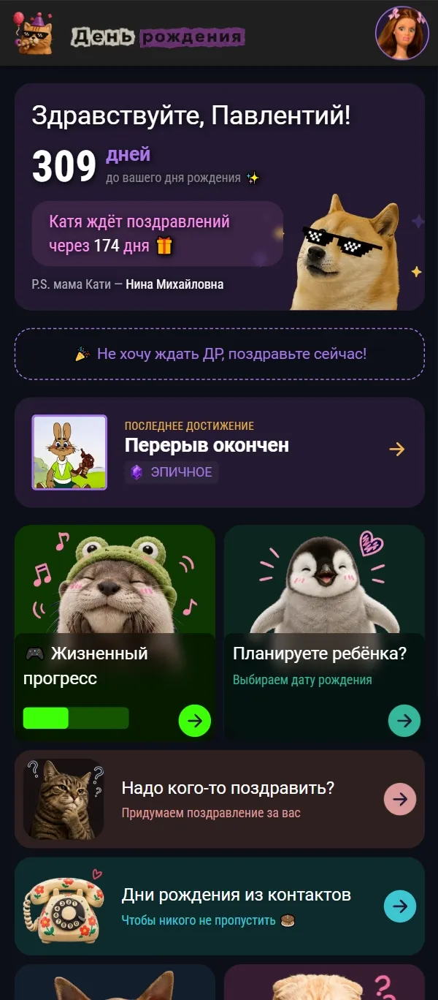<br />
      <b>Главная</b><br />
      Счётчик до дня рождения, важный человек, шпаргалка «кто это» и последнее достижение
    </td>
    <td width="50%" align="center">
      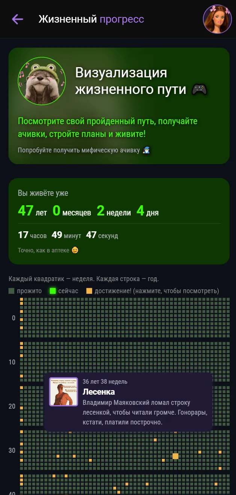<br />
      <b>Жизненный прогресс</b><br />
      Сетка недель жизни, живой счётчик и ачивки прямо на клетках
    </td>
  </tr>
  <tr>
    <td width="50%" align="center">
      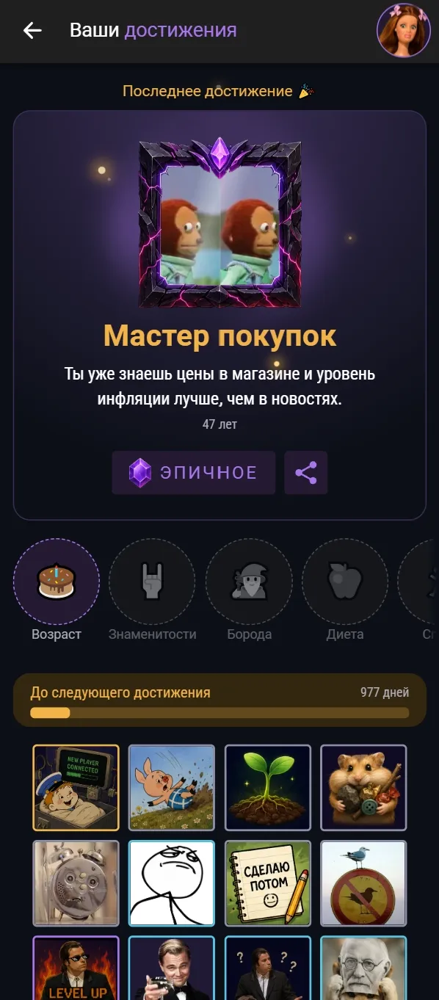<br />
      <b>Достижения</b><br />
      Последнее достижение, табы групп и прогресс до следующего
    </td>
    <td width="50%" align="center">
      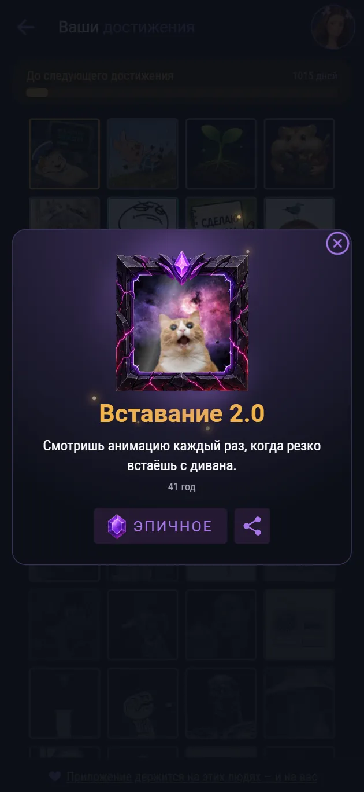<br />
      <b>Карточка достижения</b><br />
      Рамка по редкости и кнопка «поделиться»
    </td>
  </tr>
  <tr>
    <td width="50%" align="center">
      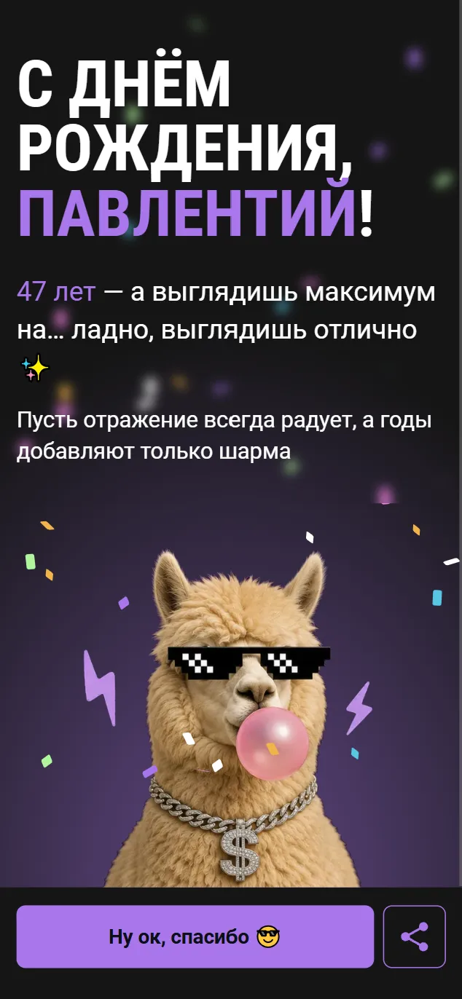<br />
      <b>Поздравление</b><br />
      Открывается само в день рождения, с конфетти и хлопушками, а кнопка на главной устроит то же самое в любой день
    </td>
    <td width="50%" align="center">
      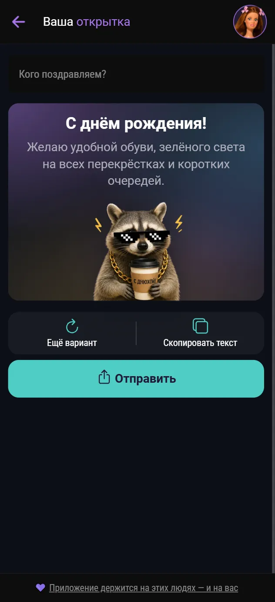<br />
      <b>Подарочная открытка</b><br />
      Генератор поздравлений: имя получателя, кнопки «ещё вариант», «скопировать текст» и «отправить»
    </td>
  </tr>
  <tr>
    <td width="50%" align="center">
      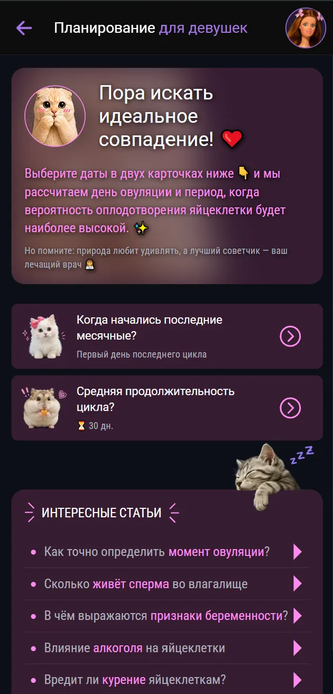<br />
      <b>Планирование для девушек</b><br />
      Дата последних месячных и длина цикла для расчёта окна фертильности
    </td>
    <td width="50%" align="center">
      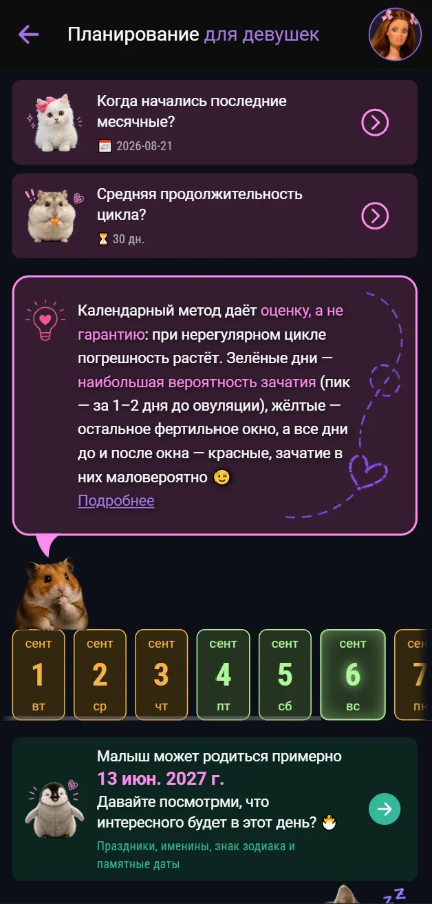<br />
      <b>Фертильное окно</b><br />
      Дни с градацией вероятности и предполагаемая дата рождения
    </td>
  </tr>
  <tr>
    <td width="50%" align="center">
      <br />
      <b>Планирование для мужиков</b><br />
      Расчёт дней высокой активности сперматозоидов с учётом алкоголя и воздержания
    </td>
    <td width="50%" align="center">
      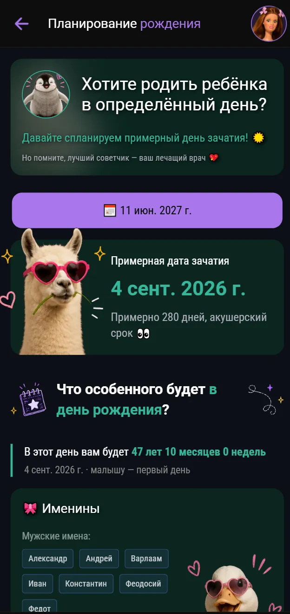<br />
      <b>Планирование рождения</b><br />
      Дата зачатия под желаемый день рождения ребёнка
    </td>
  </tr>
  <tr>
    <td width="50%" align="center">
      <br />
      <b>Дата зачатия</b><br />
      Обратный расчёт по дате рождения и что было в тот день
    </td>
    <td width="50%" align="center">
      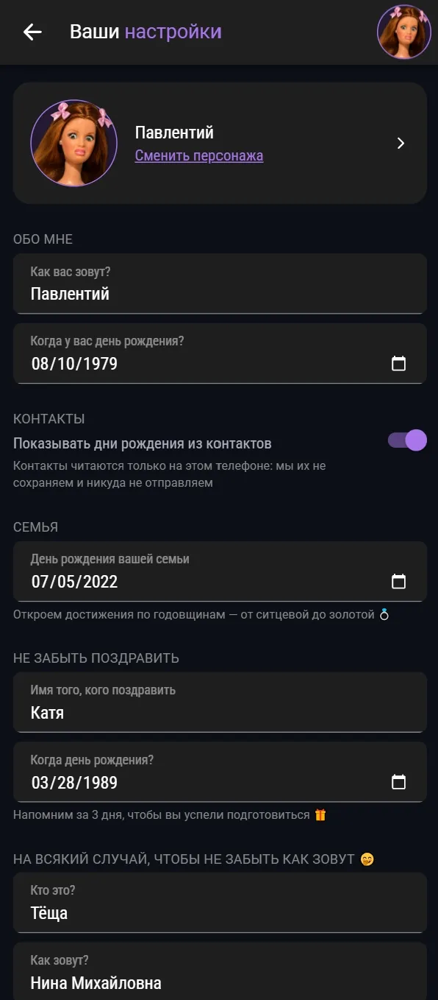<br />
      <b>Настройки</b><br />
      Персонаж, даты, тумблер контактов и шпаргалка «кто это»
    </td>
  </tr>
  <tr>
    <td width="50%" align="center">
      <br />
      <b>Выбор аватарки</b><br />
      Персонаж под настроение или кубик «решите за меня»
    </td>
    <td width="50%" align="center">
      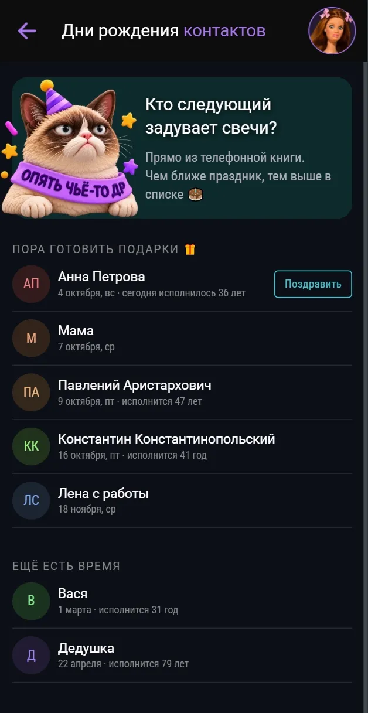<br />
      <b>Дни рождения из контактов</b><br />
      Ближайшие наверху, с днём недели и возрастом. Сегодняшних именинников можно сразу поздравить открыткой
    </td>
  </tr>
  <tr>
    <td width="50%" align="center">
      <br />
      <b>Экскурсия</b><br />
      Слайды со скриншотами разделов при первом запуске. Листаются свайпом, экскурсию можно пропустить
    </td>
    <td width="50%"></td>
  </tr>
</table>

---

## ✨ Возможности

### 👋 Экскурсия по приложению
- При первом запуске приложение показывает короткие слайды со скриншотами разделов: что оно умеет и где это искать
- Листается свайпом или кнопкой «Далее», экскурсию можно пропустить
- На слайде про контакты функцию можно включить сразу, не заходя в профиль

### 🎂 Важные даты
- Счётчик дней до вашего дня рождения
- Обратный отсчёт до дня рождения близкого человека и срочное напоминание за три дня
- Шпаргалка «кто это»: тёща, начальник и другие, чьё имя лучше не забывать
- Поздравление с конфетти: в день рождения открывается само, в другие дни по кнопке на главной. Им можно поделиться картинкой
- Аватарка-персонаж под настроение и кубик «Решите за меня» для случайного выбора

### 📇 Дни рождения из контактов
- Функция отключаемая: включается тумблером в профиле или прямо на слайде экскурсии, после этого на главной появляется плитка раздела
- Обновившимся пользователям главная предложит функцию сама, но доступ к контактам спросит только по нажатию кнопки
- Все дни рождения из телефонной книги в одном списке, ближайшие наверху. У праздников в ближайшие 60 дней указан день недели. Если в контакте есть год рождения, видно, сколько исполнится
- В день рождения контакта на главной появляется карточка: «Поздравить» открывает открытку с уже вписанным именем, «Уже поздравили» прячет карточку до следующего года
- Контакты читаются только на телефоне: приложение их не сохраняет и никуда не отправляет. Если отозвать доступ в настройках телефона, функция выключится сама

### 🎁 Подарочные открытки
- Генератор поздравлений для другого человека: шесть шаблонов и четыре пула кусочков, это больше 120 тысяч комбинаций
- Имя получателя необязательно: без него у шаблона своя формулировка заголовка, а не обрезанная
- «Ещё вариант» перебирает выдачи и не повторяет последние
- Открытку можно отправить картинкой или скопировать текстом в мессенджер
- Все формулировки безличны: ни рода, ни «ты/вы», поэтому открытка подходит любому получателю

### 🎮 Жизненный прогресс
- Каждая неделя жизни — квадратик, каждая строка — год, всё до расчётного предела
- Живой счётчик прожитого времени: годы, месяцы, недели, дни, часы, минуты, секунды
- Достижения прямо на сетке: возрастные вехи и недели жизни знаменитостей, по тапу открывается подсказка

### 🏆 Достижения
- Семь групп в табах: возраст, знаменитости, борода, диета, спорт, свадьба и особые
- Стрики привычек идут параллельно: у каждого свой запуск, сброс и ручной ввод даты начала, если привычка появилась раньше приложения
- У каждой привычки свой личный рекорд, а после сброса видна и длина прошлой серии
- Достижения за прожитые в браке годы
- Особые достижения не привязаны ко времени: одни находят вас сами, другие прячутся. Во вкладке видны только найденные
- Прогресс-бар до следующего достижения и счётчик пройденных дней внутри группы
- Пять уровней редкости со своей рамкой и иконкой: обычное, редкое, эпичное, легендарное, мифическое
- Карточка достижения открывается модалкой, ей можно поделиться картинкой
- Последнее полученное достижение видно на главной и на странице ачивок
- В `jsons/` лежат заготовки под будущие группы: игры, технологии и дни рождения. К расчёту они пока не подключены

### 👶 Планирование зачатия и рождения
- **Дата зачатия**: по дате рождения покажет примерную дату зачатия и что происходило в тот день
- **Планирование рождения**: выберите желаемый день рождения и получите расчётную дату зачатия
- Праздники, именины, знаки зодиака и памятные даты с учётом диапазона сроков беременности

### ♀️ Планирование для девушек
- Расчёт дня овуляции по дате последних месячных и длине цикла
- Длина цикла запоминается, выбрать её нужно один раз
- Фертильное окно с градацией вероятности зачатия
- Статьи о влиянии алкоголя, курения и других факторов на фертильность

### ♂️ Планирование для мужиков
- Оптимальные дни для зачатия с учётом воздержания от алкоголя и частоты эякуляций
- Алкоголь можно исключить из расчёта одним тапом
- Статьи о том, что влияет на качество спермы

### 💜 Поддержка проекта
<table>
<tr>
    <td>
      <br />
      <b>Ваша помощь</b><br />
      Список тех, благодаря кому проект живёт
    </td>
    <td>
      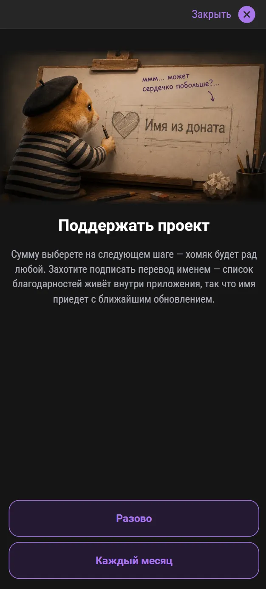<br />
      <b>Поддержать проект</b><br />
      Разовый перевод или ежемесячный, с именем в списке благодарностей
    </td>
  </tr>
</table>
<br /><br />
- Страница благодарностей со списком тех, кто помог проекту
- Перевод разовый или ежемесячный (подписка на Boosty), сумму выбирают на стороне платёжного сервиса
- Имя из доната попадает в список благодарностей с очередным обновлением

---

## 🛠 Стек технологий

| Категория     | Технология                               |
|---------------|------------------------------------------|
| Фреймворк     | Vue 3 + Composition API (`script setup`) |
| Язык          | TypeScript 5.9 (strict)                  |
| UI / Мобайл   | Ionic 8 + Capacitor 8                    |
| Сборка        | Vite 8                                   |
| Стили         | SCSS + CSS Modules                       |
| Роутинг       | Vue Router 4                             |
| Состояние     | Реактивный стор на `reactive` из Vue     |
| Хранилище     | Capacitor Preferences                    |
| Шаринг        | Capacitor Share + Filesystem, html-to-image |
| Внешние ссылки | Capacitor Browser                       |
| Контакты      | @capgo/capacitor-contacts                |
| Тесты         | Vitest (unit) + Cypress (e2e)            |

---

## 🚀 Запуск

### Веб (браузер)

```bash
npm install
npm run dev
```

> В браузере телефонной книги нет, поэтому в dev-режиме раздел контактов и карточки на главной показывают тестовые данные из `api/contactsMock.ts`. В production-сборку они не попадают.

### Android

```bash
npm run build:android
```

> Требуется установленный Android Studio и настроенный Capacitor.

### Сборка APK

```bash
npm run build:apk
```

Собирает debug-версию: `vue-tsc` → `vite build` → `cap sync android` → `assembleDebug`.
Готовый файл — `android/app/build/outputs/apk/debug/app-debug.apk`.

> Нужен `JAVA_HOME` с путём к JDK 21. Подойдёт встроенный в Android Studio,
> на Windows это `C:\Program Files\Android\Android Studio\jbr`.
> Скрипт вызывает `.\gradlew.bat`, то есть рассчитан на Windows.

### Готовые сборки

APK каждой версии лежит в [релизах](https://github.com/k206i/your-birthday/releases).
Их собирает GitHub Actions по пушу тега `v*`, workflow лежит в `.github/workflows/release.yml`.

---

## 🧪 Тесты и проверки

```bash
# Unit-тесты
npm run test:unit

# E2E-тесты
npm run test:e2e

# Линтер
npm run lint

# Сборка с проверкой типов
npm run build
```

---

## 📁 Структура проекта

```
src/
├── api/              # Работа с данными: праздники, именины, зодиак, ачивки, стрики, контакты
├── assets/           # Шрифты, глобальные стили, изображения
├── components/
│   ├── Achievement/  # Карточки, тултип, плашка редкости и изображение достижения
│   ├── AppHeader/
│   ├── AppFooter/
│   ├── AppVersion/   # Номер версии в профиле
│   ├── Avatar/       # Аватарка в шапке и выбор персонажа
│   ├── GiftCard/     # Открытка с поздравлением
│   ├── Modals/       # Поздравление с днём рождения и карточка достижения
│   ├── Ui/           # Базовые элементы (Input, DayCard, ProgressBar)
│   └── Widgets/      # Блоки страниц: PageTitle, ArtButton, LifeTime, TipInfo...
├── composables/      # Утилиты: даты, склонения, картинки ачивок, аватарки, шаринг, тумблер контактов
├── jsons/            # Датасеты: ачивки, поздравления, праздники, именины, зодиак, знаменитости
├── router/           # Маршруты приложения
├── store/            # Глобальный стор, реактивная текущая дата и дни рождения из контактов
├── views/            # Страницы
│   ├── HomePage.vue
│   ├── AchievementsPage/
│   ├── ChildBirthday/
│   ├── ContactsBirthdaysPage/
│   ├── DayConception/
│   ├── DonationsPage/
│   ├── FemaleCalendar/
│   ├── GiftCardPage/
│   ├── LifeProgress/
│   ├── MaleCalendar/
│   └── UserProfile/
├── configApp.ts      # Все настраиваемые параметры приложения
└── main.ts           # Точка входа
```

---

## ⚙️ Данные и настройки

- **`configApp.ts`** — единая точка настроек: сроки беременности, периоды воздержания, параметры овуляции, продолжительность жизни в неделях, цвета разделов и редкостей достижений.
- **`jsons/achievements_*.json`** — достижения по группам. `age` и `famous` привязаны к неделе жизни через поле `weeks`, стрики (`beard`, `diet`, `sport`) — к числу дней привычки через `days`. Группа определяется префиксом `id`: `beard_7` относится к бороде.
- **`api/getAchievementDate.ts`** — единственное место, где стрик привязан к полю стора. Словарь по типу `TStreakName` не даст добавить новый стрик и забыть про его дату: компилятор потребует запись.
- **`api/syncBirthDateAchievements.ts`** — особые достижения по дате рождения. Правила лежат таблицей, новое добавляется одной строкой. Если дату рождения поменяли и правило больше не выполняется, достижение отзывается.
- **`jsons/gift_card_templates.json` и `gift_card_slots.json`** — шаблоны открыток и пулы кусочков. У шаблона две строки заголовка (с именем и без) и один текст; куски подставляются по имени слота в фигурных скобках. Пул `gift` лежит в родительном падеже и без запятых внутри, `joke` — законченным предложением с заглавной.
- **`jsons/`** — офлайн-датасеты праздников, именин, знаков зодиака, знаменитостей и поздравлений: приложение работает без интернета.
- **`store/contactsStore.ts`** — дни рождения из контактов. Живут только в памяти: на диск не пишутся и никуда не отправляются. Сохраняются лишь флаг включения и отметки «Уже поздравили»: id контакта и дата.
- **`api/getContactsBirthdays.ts`** — чтение контактов. Книга целиком читается при запуске, при включении функции и при входе в раздел. При возврате в приложение проверяется только разрешение, потому что полное чтение дорогое.

---
## 💻 Социальные сети
Жду вас на моих каналах на [Boosty](https://boosty.to/k206i) и на [Twitch](https://www.twitch.tv/pavel_kliukin). Там я провожу стримы с совместным просмотром и обсуждением видео дней рождения, выложенных в открытом доступе, и рассказываю про дни рождения знаменитых людей.


---

Политика конфиденциальности: [PRIVACY.md](PRIVACY.md)

## 📜 Лицензия

Private — все права защищены.
